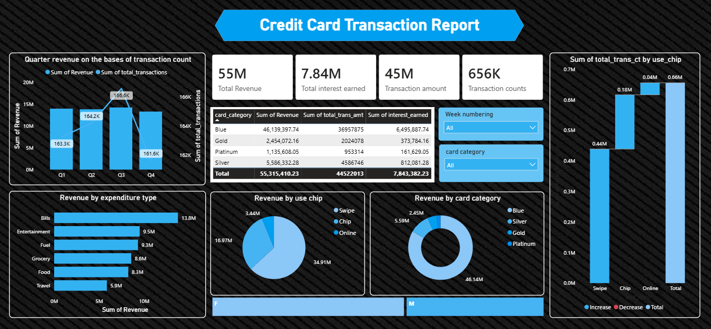
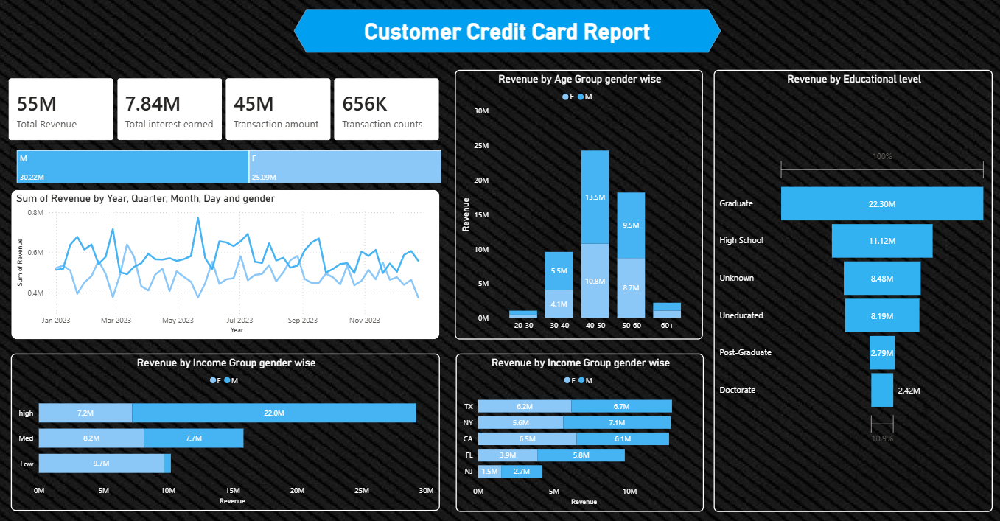
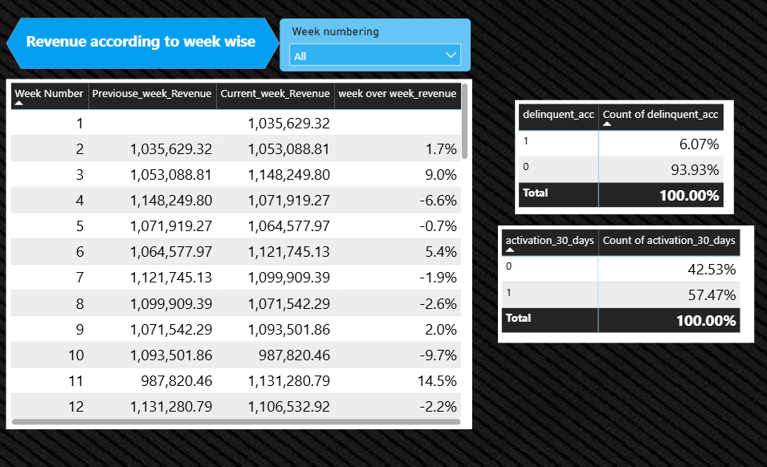

# 💳 Credit Card Transaction & Customer Analytics Dashboard

An end-to-end **Data Analytics** project built using **Power BI**, **Excel**, **Power Query**, and **DAX** to analyze credit card transactions and customer behavior. The project provides interactive dashboards that help businesses understand customer spending patterns, revenue performance, demographics, and weekly business trends for data-driven decision-making.

---

# 📌 Project Objectives

The primary objectives of this project are to:

- Analyze total revenue generated by customers.
- Study transaction patterns and payment methods.
- Understand customer demographics.
- Identify high-value customer segments.
- Evaluate card category performance.
- Analyze customer spending behavior.
- Measure card activation rates.
- Monitor customer delinquency.
- Track week-over-week revenue growth.
- Develop interactive dashboards for business decision-making.

---

# 🧹 Data Cleaning & Transformation

The following preprocessing steps were performed before analysis:

- Removed duplicate records
- Handled missing values
- Corrected data types
- Standardized categorical values
- Created calculated columns
- Developed DAX measures
- Generated Week Number
- Created Previous Week Revenue measure
- Calculated Week-over-Week Revenue Growth
- Built relationships between datasets

---

# 📊 Key Performance Indicators (KPIs)

| KPI | Value |
|------|-------|
| Total Revenue | **55M** |
| Total Interest Earned | **7.84M** |
| Total Transaction Amount | **45M** |
| Total Transactions | **656K** |

---

# 📈 Dashboard 1 – Credit Card Transaction Analysis
---
## 📷 Dashboard Preview

---
## Quarterly Revenue Analysis

### Insights

- Revenue remained relatively stable throughout the year.
- Q3 generated the highest revenue.
- Q4 experienced a slight decline.
- Transaction count peaked during Q3.

### Business Insight

Higher transaction volumes do not necessarily result in proportionally higher revenue.

---

## Card Category Performance

| Card Type | Revenue |
|-----------|---------:|
| Blue | **46.14M** |
| Silver | **5.59M** |
| Gold | **2.45M** |
| Platinum | **1.14M** |

### Insights

- Blue cards contributed approximately **84%** of total revenue.
- Platinum cards generated the lowest revenue.

### Business Insight

Blue card holders represent the largest and most valuable customer segment.

---

## Interest Earned

- Total Interest Earned: **7.84M**

### Business Insight

Interest income contributes significantly to the organization's overall revenue.

---

## Revenue by Expenditure Type

| Category | Revenue |
|----------|---------:|
| Bills | **13.8M** |
| Entertainment | **9.5M** |
| Fuel | **9.3M** |
| Grocery | **8.6M** |
| Food | **8.3M** |
| Travel | **5.9M** |

### Insights

- Bills generated the highest revenue.
- Travel generated the lowest revenue.

### Business Insight

Customers primarily use credit cards for essential expenses rather than discretionary spending like travel.

---

## Revenue by Transaction Method

| Method | Revenue |
|---------|---------:|
| Swipe | **34.91M** |
| Chip | **16.97M** |
| Online | **3.44M** |

### Insights

- Swipe transactions dominate customer usage.
- Online transactions contribute the least.

### Business Insight

Customers continue to prefer physical card transactions over online payments.

---

## Transaction Count by Card Usage

### Insights

- Swipe transactions account for the highest transaction volume.
- Chip transactions rank second.
- Online transactions remain comparatively low.

### Business Insight

Financial institutions should encourage digital payment adoption through promotional campaigns and rewards.

---

# 👥 Dashboard 2 – Customer Analytics
---
## 📷 Dashboard Preview

---
## Revenue by Gender

| Gender | Revenue |
|---------|---------:|
| Male | **30.22M** |
| Female | **25.09M** |

### Insight

Male customers generate slightly more revenue than female customers.

---

## Revenue Trend Over Time

### Insights

- Revenue fluctuates throughout the year.
- Overall revenue remains stable with periodic seasonal peaks.

### Business Insight

The business demonstrates consistent financial performance.

---

## Revenue by Age Group

| Age Group | Performance |
|-----------|-------------|
| 20–30 | Lowest |
| 30–40 | Moderate |
| 40–50 | Highest |
| 50–60 | Second Highest |
| 60+ | Lowest |

### Business Insight

Customers aged **40–50** represent the highest-value customer segment.

---

## Revenue by Education Level

| Education Level | Revenue |
|-----------------|---------:|
| Graduate | **22.30M** |
| High School | **11.12M** |
| Unknown | **8.48M** |
| Uneducated | **8.19M** |
| Post Graduate | **2.79M** |
| Doctorate | **2.42M** |

### Business Insight

Graduate customers contribute the highest revenue and should be targeted for premium financial products.

---

## Revenue by Income Group

### Insights

- High Income: **22M+**
- Medium Income: **~16M**
- Low Income: **~10M**

### Business Insight

High-income customers contribute the largest share of revenue and represent an ideal segment for premium services.

---

## Revenue by State

### Top Performing States

- Texas
- New York
- California

### Business Insight

Regional marketing campaigns should prioritize these high-performing states.

---

# 📅 Dashboard 3 – Weekly Performance Report
---
## 📷 Dashboard Preview

---
## Week-over-Week Revenue Growth

The report compares:

- Previous Week Revenue
- Current Week Revenue
- Weekly Revenue Growth (%)

### Sample Weekly Performance

| Week | Growth |
|------|--------:|
| Week 3 | **+9.0%** |
| Week 4 | **−6.6%** |
| Week 11 | **+14.5%** |

### Business Insight

Weekly monitoring enables quick identification of revenue growth opportunities and performance declines.

---

## Customer Delinquency Rate

| Status | Percentage |
|---------|-----------:|
| Delinquent Customers | **6.07%** |
| Non-Delinquent Customers | **93.93%** |

### Business Insight

The low delinquency rate indicates a healthy customer credit portfolio.

---

## Card Activation Rate

| Status | Percentage |
|---------|-----------:|
| Activated Cards | **57.47%** |
| Inactive Cards | **42.53%** |

### Business Insight

A significant number of customers have not activated their cards, presenting opportunities for customer engagement campaigns.

---

# 📌 Overall Business Insights

- Blue cards generate the majority of total revenue.
- Swipe is the most frequently used transaction method.
- Bills represent the highest spending category.
- Customers aged **40–50** generate the highest revenue.
- High-income customers contribute significantly more revenue than other income groups.
- Graduate customers are the most profitable educational segment.
- Male customers contribute slightly more revenue than female customers.
- Texas, New York, and California are the highest-performing states.
- Card activation rates indicate opportunities for increasing customer engagement.
- Customer delinquency remains relatively low.
- Weekly revenue tracking helps monitor business performance and identify growth opportunities.

---

# 💡 Business Recommendations

- Upgrade Blue card customers to premium card categories.
- Increase incentives for online transactions.
- Target customers aged **40–50** with personalized marketing campaigns.
- Develop loyalty programs for high-income customers.
- Encourage inactive customers to activate their credit cards.
- Focus marketing efforts on Texas, New York, and California.
- Introduce cashback offers for travel spending.
- Continuously monitor weekly revenue trends for proactive business decisions.

---

# 🛠️ Tools & Technologies

- Power BI
- Microsoft Excel
- Power Query
- DAX (Data Analysis Expressions)
- Data Modeling
- Data Cleaning
- Data Visualization

---

# 📚 Skills Demonstrated

- Data Cleaning
- Data Transformation
- Exploratory Data Analysis (EDA)
- Data Modeling
- DAX Calculations
- KPI Development
- Dashboard Design
- Business Intelligence
- Data Visualization
- Business Insight Generation
- Analytical Thinking
- Storytelling with Data

---

# 📌 Conclusion

This project demonstrates how raw credit card transaction and customer data can be transformed into actionable business insights through interactive Power BI dashboards. The analysis highlights customer behavior, spending patterns, transaction methods, revenue trends, demographic performance, activation rates, and delinquency metrics. The resulting dashboards support data-driven decision-making and showcase practical Business Intelligence and Data Analytics skills.
